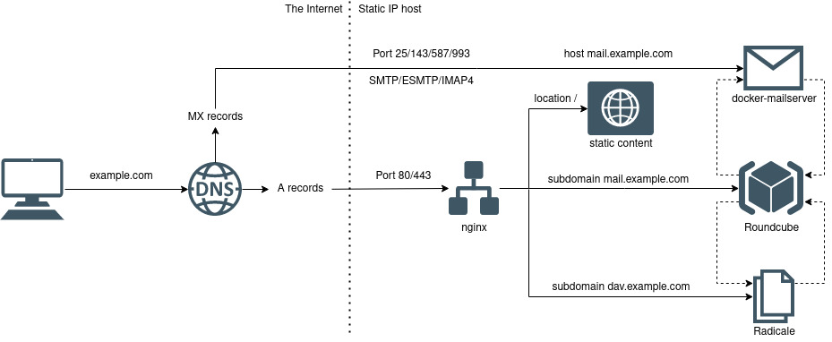

# Personal server
Collection of FOSS Docker containers, composed of

- **Web server:** [nginx](https://nginx.org/), modified to include [certbot](https://certbot.eff.org) for ease of
  obtaining and renewing LetsEncrypt SSL certificates.
- **Email stack:** [docker-mailserver](https://docker-mailserver.github.io/docker-mailserver/v9.1/), configured with
  DKIM/SPF/DMARC.
- **Webmail client:** [Roundcube](https://roundcube.net/) with
  [context-menu](https://github.com/johndoh/roundcube-contextmenu),
  [persistent-login](https://github.com/mfreiholz/persistent_login) and
  [CardDAV](https://github.com/mstilkerich/rcmcarddav) plugins, set up to include GPG support.
- **CardDAV server:** [Radicale](https://radicale.org/3.0.html), used to sync Roundcube contacts with e.g. an
  Android phone.

A simplified scheme of the server is portrayed below.



## Setting up the server
Notation used:
- X.X.X.X - the static host **IPv4 address**.
- example.com - your **domain name** purchased at the registrar.
- `./` - the root of the project (ie. the directory containing docker-compose.yml).

### Project structure
The project structure is as follows:
```
./
│
├─ config/
│  ├─ radicale/
│  ├─ roundcube/
│  └─ nginx/
│
├─ build/
│  ├─ radicale/
│  ├─ nginx-certbot/
│  └─ roundcube/
│
├─ data/
│  ├─ roundcube/
│  ├─ nginx/
│  ├─ radicale/
│  ├─ mailserver/
│  └─ letsencrypt/
│
├─ docker-compose.yml
└─ admin.sh
```
The `./data` folder contains all of the persistent Docker volumes, easy to backup and restore in the case of failure.

Static website content found on example.com and www.example.com is hosted from `./data/nginx/default`.

### DNS records

The configuration assumes the following dns records (arrow meaning "pointing to"):

| A | CNAME | MX | TXT |
| --- | --- | --- | --- |
| example.com → X.X.X.X | dav.example.com → example.com | *empty* → mail.example.com | DKIM |
| www.example.com → X.X.X.X | | | DMARC |
| mail.example.com → X.X.X.X | | | SPF|

The TXT records ensure no email spoofing has taken place and greatly increase the probability of our
messages not being flagged as spam. They require the server to be already running and are discussed in more detail in
[#Mail server administration](#mail-server-administration).

## First launch
All of the following steps are accomplished using the `./admin.sh` script provided in the associated
[GitHub](https://github.com/piotr-machura/personal-server/) repository. Edit the `DOMAIN` variable and use `chmod + x
./admin.sh` followed by `./admin.sh -h` to view all the available options.

To make sure our host machine is ready for launch run `./admin.sh -i`. The flag assumes the host system is running
CentOS (it uses `firewall-cmd` and `dnf`), comment that section to configure your firewall and install
Docker/docker-compose  manually if you use a different OS.

The script will check if Docker, docker-compose and other required tools are available and download them as necessary,
as well as copy the `./config/nginx/*.conf.dist` files and launch Certbot in order to obtain all SSL certificates if
they are not already present. Follow the steps when prompted by Certbot and agree to modifying the configuration to
create redirects from HTTP to HTTPS in all of the `./config/nginx/*.conf` files.

After it is done visit example.com in your browser. You should be greeted by a default nginx
welcome screen and a green padlock on the URL bar signifying encrypted connection. Add a basic
`./data/nginx/default/index.html` to verify that static content from said directory is hosted properly.

## Mail server administration
The docker-mailserver container comes with it's own script for creating and managing user accounts, aliases and many
other functionalities. This script is downloaded by `./admin.sh` and properly wrapped with the `-m` flag.

Create a user with `./admin.sh -m email add username@example.com` and provide a password when prompted. Once a user has
been created DNS text records used to prevent spoofing can be geneated. Use `./admin.sh -mk` and add the contents in
appropriate records in your DNS provider's interface. The format is `<host name> IN TXT <contents>`, note that the SPF
record has an empty host name.

After you modify your DNS records you can use a tool like [AppmailDev](https://appmaildev.com/)'s DKIM test to verify
that the messages are signed correctly. Simply navigate to example.com/mail in your browser, log into your newly
created user account and compose a message.

## CardDAV administration
Users can be added and removed from the Radicale server with `./admin.sh -da` and `./admin.sh -dd` respectively. List
them with `./admin.sh -dl`.

Once you have created some users navigate to dav.example.com in your browser and log in to see the available
collections. Create a new address book using Radicale's web interface.

In order to sync the contacts with the Roundcube client log into your email account under example.com/mail and navigate
to *"Settings/Proferences/CardDAV*. Use your CardDAV username and password and dav.example.com as the server's address.
Hit *"Save"* and the address book should appear in *"Contacts"*. Add contacts to your heart's content.

The `./admin.sh` script allows for easy maintenance of the running services Use `./admin.sh -h` and `./admin.sh -m help`
to get information on the available functionality.
